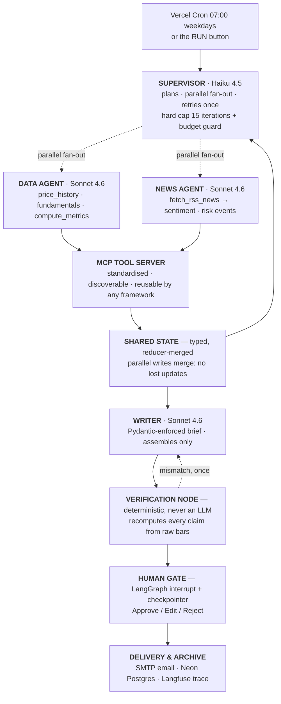

# AlphaBrief

[](https://github.com/Abdr007/alphabrief/actions/workflows/ci.yml)

**Multi-Agent Research Orchestration System with MCP Tooling & Human-in-the-Loop Governance**

A supervisor-pattern agent system that produces a verified morning research brief
for a watchlist. A supervisor plans the run, a data agent and a news agent work
in parallel through a Model Context Protocol tool server, a writer synthesises a
Pydantic-enforced brief, a deterministic verifier recomputes every number, and a
human approves before anything ships.

> **The LLM never does arithmetic.** Tools compute over MCP, a deterministic node
> recomputes every figure in the final brief, and a human gate signs off —
> hallucinated numbers are impossible by construction, not by prompt-begging.

| | |
| --- | --- |
| **Stack** | LangGraph · MCP (Model Context Protocol) · Claude Sonnet 4.6 + Haiku 4.5 · FastAPI · yfinance · Next.js 15 · Neon Postgres · Langfuse · Docker · GCP Cloud Run · Terraform · Vercel Cron |
| **Cost** | `$0`. yfinance and RSS are free and keyless; Cloud Run, Vercel, Neon and Langfuse free tiers; ~$0.05–0.15 of Claude per full 5-ticker brief |
| **Quality gates** | ruff · ruff-format · mypy `--strict` · 190 pytest tests · eslint · tsc · `next build` — all zero-warning |
| **Verification** | 100% of numeric claims recomputed from raw price bars before delivery |

---

## Why this exists

I did financial data analysis manually for two years — pulling prices, computing
ratios, scanning news, writing the same morning picture. AlphaBrief is that job
as a governed agent system.

The interesting part is not that agents can fetch data. It is that **the system
is built so that a wrong number cannot reach the reader**:

1. **Agents decide *what* to compute; code computes it.** Every figure comes from
   an MCP tool. The model chooses which metric matters, never what it equals.
2. **The brief cannot contain a typed number.** The Pydantic schema rejects any
   narrative string containing a bare numeral. Figures are written as `{{c7}}`
   references into a claim table minted from tool output.
3. **Every claim is recomputed independently.** A deterministic node recalculates
   each figure from the raw price bars, through a *different implementation* than
   the tool used, and compares to the cent.
4. **Every quotation is matched.** Quoted headlines must appear verbatim in the
   news actually retrieved for that ticker.
5. **A human signs off.** The graph pauses at a LangGraph interrupt over a
   checkpointer. There is no path from the verifier to delivery that skips it.

---

## Architecture



The graph is assembled in [`app/graph/build.py`](apps/api/app/graph/build.py) and
this diagram is reproducible with:

```bash
python -c "import sys; sys.path.insert(0,'apps/api'); from app.graph.build import mermaid_diagram; print(mermaid_diagram())"
```

### The parallel fan-out, concretely

The supervisor's conditional edge returns a **list** of node names, which puts
both workers in the same LangGraph superstep. They write to the same state object
concurrently, so every shared channel carries an explicit reducer:

```python
prices: Annotated[dict[str, PriceHistory], merge_mapping]  # data agent
sentiment: Annotated[dict[str, Sentiment], merge_mapping]  # news agent
errors: Annotated[list[RunError], append_errors]  # BOTH
attempts: Annotated[dict[str, int], merge_counters]  # BOTH
token_spend: Annotated[TokenSpend, merge_spend]  # BOTH
iterations: Annotated[int, operator.add]  # supervisor
```

There is no read-modify-write anywhere — only commutative merges applied by the
runtime. `tests/test_reducers.py` proves both agents' writes survive a real
superstep, not a mocked one.

---

## The MCP tool server

All market, news and metric capability is exposed over MCP, so the tools are
standardised, discoverable, and reusable by **any** agent framework — not just
this app. The server runs over stdio inside the same container
(`python -m app.mcp_server`), and the same tools are listable over HTTP at
`GET /v1/mcp/tools`.

The tool set is a **closed whitelist**, enforced on both the server and the
client. There is no `run_python`, no `eval`, no shell.

| Tool | Signature | Returns |
| --- | --- | --- |
| `get_price_history` | `(ticker: str, days: int = 120)` | Daily OHLCV bars, oldest → newest, in the quote currency. On an unknown ticker: an `error` string and empty `bars` — never an exception. |
| `get_fundamentals` | `(ticker: str)` | Company name, sector, currency, trailing and forward P/E, market cap. Individual fields may be null (a loss-making company has no trailing P/E). |
| `compute_metrics` | `(ticker: str, bars: list[PriceBar], pe_ratio: float \| None)` | `last_close`, `previous_close`, `change_1d_pct`, `return_30d_pct`, `volatility_annualised_pct`, `max_drawdown_pct`, `pe_ratio`, plus the exact baseline date used for the 30-day return. |
| `fetch_rss_news` | `(ticker: str, limit: int = 6)` | De-duplicated headlines merged from Yahoo Finance and Google News RSS. An empty list with no `error` is a legitimate outcome. |

**Metric definitions** are fixed and published, because the verifier has to
reproduce them exactly:

- `return_30d_pct` — change from the close of the last bar dated on or before
  `last_trading_date − 30 calendar days` to the latest close.
- `volatility_annualised_pct` — sample standard deviation (ddof = 1) of daily log
  returns over the window, × √252, in percent.
- `max_drawdown_pct` — the most negative value of `close / running_peak − 1`,
  always ≤ 0.

Tools are **cached per run**, **politely rate limited**, and **failure-tolerant
by contract**: they return a structured `error` field rather than raising, which
is what makes graceful degradation possible at all.

---

## How a number gets into the brief

```
yfinance bars ──► compute_metrics (MCP) ──► claim table  c1..cN
                                                │
                     writer may cite {{c7}} ────┤  (schema rejects bare numerals)
                                                │
raw bars ──► app/graph/recompute.py ────────────┴──► compare to the cent
                (independent implementation)          │
                                                      ├─ match     → human gate
                                                      └─ mismatch  → 1 regeneration
                                                                    → HUMAN_REVIEW
```

`recompute.py` deliberately does **not** import the tool's maths. It implements
the same published definitions through different code — Welford's online variance
instead of a two-pass mean, `itertools.accumulate` instead of a running-peak loop,
`bisect` instead of a forward scan. A test asserts the two paths agree on live
market data, so the dual-path check is real rather than decorative.

---

## Production quality bar

| Category | How it is met |
| --- | --- |
| **Loop safety** | Supervisor hard cap of 15 iterations **and** an independent per-run token/USD budget guard that aborts with `BUDGET_ABORT`. `test_forced_loop_terminates` wires workers that never complete and proves the run still stops. |
| **Race conditions** | Reducer-merged state (above); DB writes are single committed transactions; **one active run per watchlist is enforced by a partial unique index in the database**, not by an application check. |
| **Graceful degradation** | Fake ticker, dead network and empty RSS each have dedicated tests that induce the failure *for real* — an unknown symbol, an unroutable proxy, a genuinely empty feed. The run completes with per-ticker errors and a brief explicitly marked partial. |
| **Numeric integrity** | 100% of claims recomputed; mismatch → exactly one regeneration → `HUMAN_REVIEW`. The eval reports post-verification accuracy across 20 runs. |
| **Security** | MCP tools whitelisted; agents cannot widen their assigned ticker scope; news text is hardened, fenced in `<untrusted_data>` and treated as data; secrets only via env; approval endpoints behind a constant-time bearer check; security headers, body-size cap and per-client rate limiting on every request. |
| **Zero warnings** | ruff, ruff-format, mypy `--strict`, pytest (with `filterwarnings = error`), eslint, tsc and `next build` all clean. |

---

## Running it locally

### Prerequisites

Python 3.12 (via [uv](https://docs.astral.sh/uv/)) and Node 20+.

### 1. API

```bash
cd apps/api
uv venv --python 3.12 .venv
uv pip install --python .venv/bin/python -e ".[dev]"

cp ../../.env.example ../../.env      # then edit
.venv/bin/uvicorn app.main:app --port 7877 --reload
```

Open <http://127.0.0.1:7877/docs>.

**You do not need a Claude API key to run this.** With `ANTHROPIC_API_KEY`
unset, the app uses a deterministic engine that drives the *identical* graph,
the *identical* MCP tools and the *identical* verifier — only the model's
decision-making is replaced by rules. Market data is still live. This is what
keeps CI and the 20-run eval free. Add the key and it switches to Claude.

### 2. Web console

```bash
cd apps/web
npm install
ALPHABRIEF_API_URL=http://127.0.0.1:7877 \
ALPHABRIEF_APPROVAL_TOKEN=<same as APPROVAL_TOKEN> \
npm run dev
```

Open <http://localhost:3001> and press **RUN**.

The browser never talks to the API directly — every call is proxied through a
Next route handler so the approval token stays server-side.

### 3. Quality gates

```bash
make check      # ruff + format + mypy + pytest + eslint + tsc + next build
make eval       # 20 scored runs → eval/results.md
```

---

## Free deployment map

| Service | Free tier used | Limit to respect |
| --- | --- | --- |
| **GCP Cloud Run** *(primary API host)* | 2M requests + 360k GB-seconds/month, forever | Keep `min_instance_count = 0`; 1 vCPU / 512Mi. Needs a card on file, though this usage does not bill |
| **Koyeb** *(no-card fallback)* | 1 web service from a Docker image | 0.1 vCPU / 512Mi is tight for pandas — expect slower briefs than the figures below |
| **Vercel** | Hobby: web + Cron | Cron on Hobby is once/day — exactly the 07:00 run |
| **Neon** | Free Postgres | Ample for runs, briefs, approvals |
| **Langfuse** | Free tier | Ample for traces |
| **yfinance / RSS / Gmail SMTP** | Free, keyless / app password | Cached per run; polite rate limiting |
| **Claude API** | Your key | Haiku-routed supervisor + capped iterations → ~$0.05–0.15 per brief |

### GCP Cloud Run (recommended)

```bash
PROJECT=your-project
REGION=us-central1
REPO=$REGION-docker.pkg.dev/$PROJECT/alphabrief-api-images

gcloud auth login
gcloud config set project $PROJECT
gcloud services enable run.googleapis.com artifactregistry.googleapis.com secretmanager.googleapis.com
gcloud artifacts repositories create alphabrief-api-images --repository-format=docker --location=$REGION

gcloud auth configure-docker $REGION-docker.pkg.dev
docker build -t $REPO/api:v1 -f apps/api/Dockerfile apps/api
docker push $REPO/api:v1

gcloud run deploy alphabrief-api \
  --image $REPO/api:v1 --region $REGION \
  --port 7860 --allow-unauthenticated \
  --min-instances 0 --max-instances 2 \
  --memory 512Mi --cpu 1 --timeout 900 \
  --set-env-vars ENVIRONMENT=production,MCP_TRANSPORT=stdio,CORS_ALLOW_ORIGINS=https://alphabrief.vercel.app \
  --set-secrets ANTHROPIC_API_KEY=alphabrief-api-anthropic-api-key:latest,APPROVAL_TOKEN=alphabrief-api-approval-token:latest,DATABASE_URL=alphabrief-api-database-url:latest
```

Or declaratively — which is what puts *Terraform (IaC)* on the resume honestly:

```bash
cd infra/terraform
terraform init
terraform apply -var project_id=$PROJECT -var image=$REPO/api:v1
```

### Koyeb (no card needed)

Create a web service from `apps/api/Dockerfile`. The image already listens on
7860 and runs as **uid 1000**, so it drops straight onto any host that refuses
root — no changes needed. Set the same environment variables as service secrets.

The free instance is 0.1 vCPU / 512 MiB. `yfinance` pulls in pandas and numpy, so
memory is tight and briefs are slower than the figures in this README, which were
measured on a laptop. Fine for a shareable link; use Cloud Run for a live demo.

### Vercel (web + cron)

```bash
cd apps/web
vercel deploy --prod
```

Set `ALPHABRIEF_API_URL`, `ALPHABRIEF_APPROVAL_TOKEN` and
`ALPHABRIEF_DEFAULT_WATCHLIST` as project environment variables. `vercel.json`
already declares the weekday 07:00 cron hitting `/api/trigger`; Vercel supplies
`CRON_SECRET`, which the route verifies in constant time.

### Neon, Langfuse, Gmail

- **Neon** — create a project, copy the connection string into `DATABASE_URL`.
  Tables and the LangGraph Postgres checkpointer are created on boot.
- **Langfuse** — create a project, set `LANGFUSE_PUBLIC_KEY` / `LANGFUSE_SECRET_KEY`.
  Without them the tracer is a silent no-op.
- **Gmail** — enable 2FA, create an app password, set `SMTP_*`. Without SMTP the
  brief is archived but not emailed, and the run says so.

### Production upgrade path

yfinance is free, real and rate-limited by courtesy rather than contract. For
production the swap is one module: `app/mcp_server/providers.py` is the only
place a provider is called, so moving to Polygon, Databento or a paid feed means
changing that file and nothing else — the MCP tool contracts, the graph, the
verifier and the UI are unaffected.

---

## Design decisions worth defending

**Why LangGraph over CrewAI or AutoGen.** I evaluated all three. CrewAI is faster
to a first demo but gives less control over state and routing; AutoGen models work
as a conversation between agents, which is hard to make deterministic. LangGraph
gives an explicit graph, typed reducer-merged state, and — decisively here —
native human-in-the-loop via interrupts over a checkpointer. Production control
beat time-to-first-demo.

**Why MCP for the tool layer.** It is the USB-C of AI tools: the same four tools
are consumable by this LangGraph app, by Claude Desktop, or by any other MCP
client, with schemas and documentation discoverable at runtime. It also draws a
hard security boundary — a closed, whitelisted tool surface.

**Why runtime context, not `config["configurable"]`.** LangGraph filters unknown
`configurable` keys when a checkpointer is attached, so live handles (the open
MCP session, the event bus) must travel in the runtime `context` channel, which
is deliberately not persisted. This was found by testing, not by reading.

**Why n8n is not in the cloud path.** I used n8n for scheduling in an earlier
project. Here Vercel Cron does the same job with one less service to run, and the
scheduled path is a plain authenticated HTTP call that is trivial to test.

---

## Visual identity

AlphaBrief is an **amber phosphor terminal**: true black `#08090b`, amber
`#ffb454`, phosphor green `#35d07f` for verified figures, monospace throughout,
ruled columns and CRT scanlines. Not a dashboard — a trading-floor instrument.

That is a deliberate departure from the build spec, which asked all three
portfolio demos to share one dark/cyan design system. Two of them already had
byte-identical tokens, so a third would have read as the same template three
times. The reasoning is recorded in [SPEC_TRACE.md](SPEC_TRACE.md) §*Deviations*.

---

## Repository layout

```
alphabrief/
├── apps/
│   ├── api/                    FastAPI + LangGraph + MCP server (one container)
│   │   ├── app/
│   │   │   ├── graph/          state · supervisor · data_agent · news_agent
│   │   │   │                   writer · verify · gate · deliver · recompute
│   │   │   ├── mcp_server/     prices · fundamentals · metrics · rss_news
│   │   │   ├── core/           claude router · langfuse · budget guard · settings
│   │   │   ├── models/         brief schema · market contracts · SQLAlchemy tables
│   │   │   ├── services/       runner · repository · render · email
│   │   │   └── api/            routes · schemas
│   │   └── tests/              190 tests incl. every mandated case
│   └── web/                    Next.js 15 console
├── eval/                       run_eval.py → results.md
├── infra/terraform/            Cloud Run + Secret Manager, declaratively
├── AUDIT.md                    every Definition-of-Done check, with evidence
├── SPEC_TRACE.md               spec requirement → implementation → test
├── LEARNING.md                 the study path through this codebase
└── RESUME.md                   resume bullets + ATS skills block
```

---

## Documentation

- **[AUDIT.md](AUDIT.md)** — the Definition of Done, check by check, with the
  command that proves each one.
- **[SPEC_TRACE.md](SPEC_TRACE.md)** — every requirement in the build spec mapped
  to the file that implements it and the test that holds it.
- **[LEARNING.md](LEARNING.md)** — the order to read this codebase in, and the
  interview question each file answers.
- **[RESUME.md](RESUME.md)** — resume bullets with real measured numbers.
- **[eval/results.md](eval/results.md)** — the latest 20-run evaluation.

## License

MIT.
